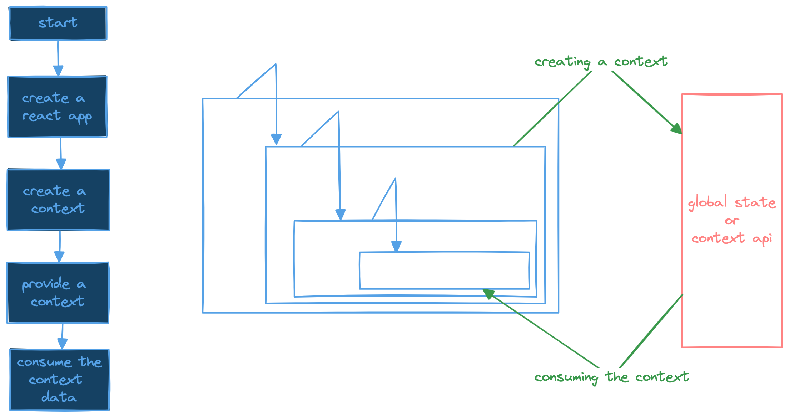

# React_context_API

*React Context is an inbuilt _Global State Management_ which provides a way to pass data through the component tree without having to pass down data as props manually through each level.*

For State management we use external libraries as well but in react we have `React-Context`, `Context-Provider` and along with that `useContext` hook..

*It provides a way to share values between components without repeatedly passing props which is not a good practice as it requires rendering of data to intermidiate components as well where the data is not utilized.*

Context shares data by making it globally available for a tree of react components. Data such as : 
- Current Authenticated User
- Theme Preferences
- Language

Structured Sample : 

When we create a context there is no data and we create a context using react create-context which will be an empty repo. Once the context is created, to make this context usable we need context-provider. A central main to read and feed the data when required. It will be a wrapper just like in `main.jsx` we usually use `react-strict-mode` wrapper we have a `react-context-provider` which wraps the component root and makes data available to all the elements that fall as child-elements in the app structure.

The React Context API is useful for both single-page and multi-page applications. Its primary benefit is managing and sharing state across different components, regardless of how your application is structured.

### When to Use Multiple Contexts ?
1. Separation of Concerns: If different parts of your application have distinct pieces of state that don't need to interact with each other, it's often a good idea to use separate contexts. For example, UserContext for user details, ThemeContext for theme settings, and LanguageContext for localization.

2. Performance Optimization: Using separate contexts can help avoid unnecessary re-renders. When a context value changes, all components consuming that context will re-render. By separating contexts, you ensure that only components that depend on the changed context re-render.

### When to Use a Single Context ?
1. Related State: If you have state that is logically grouped together, it might make sense to use a single context. For example, if you have a UserContext that includes user details, authentication status, and user preferences, you might group all of these related states into a single context.

2. Simplified Management: Sometimes managing multiple contexts can become cumbersome, especially if you have to pass them through multiple providers. A single context can simplify the provider tree and make it easier to manage state in one place.

### Conclusion :
- The Context API is versatile and beneficial for both single-page and multi-page applications.
- It helps manage and share state efficiently across components and routes, reducing the need for prop drilling and simplifying state management.
Whether you choose to use multiple contexts or a single context depends on your application’s needs and how you want to structure your state management.

